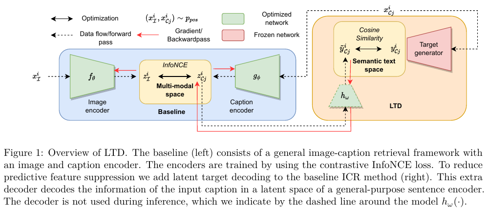

#  Reducing Predictive Feature Suppression in Resource-Constrained Contrastive Image-Caption Retrieval.

This is the PyTorch code repository for the TMLR paper: [Reducing Predictive Feature Suppression in Resource-Constrained Contrastive Image-Caption Retrieval](https://openreview.net/forum?id=T1XtOqrVKn), by [Maurits Bleeker](https://mauritsbleeker.github.io)<sup>1</sup>, [Andrew Yates](https://andrewyates.net)<sup>1</sup>, and [Maarten de Rijke](https://staff.fnwi.uva.nl/m.derijke/)<sup>1</sup>.

If you have any questions, please open an issue or feel free to send an email to [m.j.r.bleeker@uva.nl](m.j.r.bleeker@uva.nl).

<sup>1</sup>University of Amsterdam, The Netherlands
## Introduction

The code of this work is mainly based on the code repositories of [PCME](https://github.com/naver-ai/pcme), [VSRR](https://github.com/KunpengLi1994/VSRN), [VSE++](https://github.com/fartashf/vsepp), and [TERN](https://github.com/mesnico/TERN). 

Not all experiments we have run made it into the final version of the paper.




## Environment, dependencies, and required packages

This project has been developed and tested in Python 3.6.13.
All the libraries and Python dependencies used in this work are provided in `src/requirements.txt`.

```
pip install -r src/requirements.txt
python -c 'import nltk; nltk.download("punkt", download_dir="/downloads")'
```
 
## Data and data processing

For this work, we use the [Flickr30k (F30k)](https://shannon.cs.illinois.edu/DenotationGraph/) and [MS-COCO Captions dataset (COCO)](https://github.com/tylin/coco-caption), including the the [CrissCrossed Captions](https://github.com/google-research-datasets/Crisscrossed-Captions) annotations (CxC).

We store the entire dataset in a pickle file, to make training faster than loading the images one by one from disk. However, this requires a large RAM memory.

Please note that most pre-processing files use a fixed file path, you have to change this to the locations where you have stored the data/output files. 

Please use the following URLs for the precomputed [VSRR](https://github.com/KunpengLi1994/VSRN) and [TERN](https://github.com/mesnico/TERN) features.

### Data processing

The caption annotations and train/val/test splits for the Flicker30k and MS-COCO dataset can be downloaded [here](http://cs.stanford.edu/people/karpathy/deepimagesent/caption_datasets.zip).
In the folder `annotations/f30k` we provide the JSON file for the Flicker30k dataset. The json file for MS-COCO is too big to upload to GitHub. 

To generate the pickle file, run the function `process_dataset(json_file, img_folder, dset_name, root, k=5)` from the file `data/data_processing.py`.   

### Vocabulary classes 

Each dataset has a different vocabulary. In the file `data/vocab.py` the Vocabulary class is provided, together with the `build_vocab(captions, threshold=0)` function. 
In the file `notebooks/data_processing/vocab.ipynb`, we build the vocab for each dataset.
We provide a pickle file of the MS-COCO and F30k Vocab class used in this work in the folder `vocab/`, so you don't have to generate the vocab files yourself.

### Adding the CxC annotations

To add the CxC annotations to the dataset(s), run `notebooks/data_processing/CrissCrossed.ipynb`.
Please use the following URL for the CxC annotations: [CrissCrossed Captions](https://github.com/google-research-datasets/Crisscrossed-Captions/tree/master/data).

### Targets generator

After generating the pickle file for the MS-COCO and Flicker30K dataset the latent targets should be added.
To add the latent targets to the pickle files, run the `notebooks/data_processing/caption_targets.ipynb` file.

### Additional data processing 

In the folder `notesbooks/data_proccessing` additional notebooks are provided for additional data processing for the CxC, VSRN, and TERN dataset

- A notebook to add the size of the images, needed for TERN for normalizing the bounding boxes coordinates, to the pickle files ` notebooks/data_proccessing/add-img-size-to-data`.
- A notebook to add the precomputed features for TERN to the pickle file `notebooks/data_proccessing/add-precomputed-tern-images.ipynb` (`add-precomputed-tern-images.py` is similar, but just a plain python file).

## Training and reproducing experiments 

To run the training script, simply run the one line command:
 
 ```
 python train.py --yaml_file configs/f30k/f30k_tmlr.yaml
 ```
 
for the F30k dataset, and
```
python train.py --yaml_file configs/coco/coco_tmlr.yaml
```
for the COCO dataset.

In the folder `configs/{coco, f30k}/{coco, f30k}_tmlr.yaml` the config yaml files are provided to the base models for experiments 5.1-5.4.

To run the experiments for experiment 5.5 run either `python train.py --yaml_file configs/coco/coco_vsrn.yaml` or  `python train.py --yaml_file configs/f30k/f30k_vsrn.yaml` to train with the VSRN image encoder, or `python train.py --yaml_file configs/coco/coco_tern.yaml` to train with TERN.

### Training hyperparameters used in this work

To train other and different model configurations, we change the following training hyper parameters.
 
- `--experiment.experiment_name`: name of the experiment. Used for the WandB logging and to store the model checkpoints.
- `--model.target_decoder.decode_target`: Decode a target for the caption representation.
- `--recconstruction_constraint.use_constraint`:  Use constraint-based optimization.
- `--model.target_decoder.input_decoding`: Decode the caption in the input space.
- `--recconstruction_constraint.bound`: Lower bound value for the optimization constraint. 
- `--optimizer.weight_averaging.use_weight_averaging`: Use [Stochastic Weight Averaging](https://pytorch.org/blog/stochastic-weight-averaging-in-pytorch/). 
- `--model.image_encoder.cnn_type`: The type of ResNet used for the image encoder backbone. Default is `resnet50`.
- `--train.n_epochs`: Number of training epcohs. Default value is `60`.
- `--model.caption_encoder.tune_from_start`: Tune the word embeddings for the caption encoder from the start of the training.
- `--lr_scheduler.name`: LR schedule used for training. The default is `cosine_annealing`, other option is `multi_step_lr`.
- `--lr_scheduler.milestones`: Number of epochs before lowering the lr with factor `finetune_lr_decay`. Only when using `multi_step_lr`.
- `--criterion.name` infonce or triplet, choice of contrastive loss.

All the other hyperparameters can be found in `configs/{coco, f30k}/{coco, f30k}_tmlr.yaml`. 

### Job files

All experiments for the paper have been run on a SLURM  compute cluster.
The job and hyper-parameter files for each experiment are provided in the folder `jobs/{coco, f30k}/{TERN, VSRN, tmlr}`.

## Evaluation

To run a trained model on the test set run 
```
python evaluate.py --path_to_model <path to model>/model_best.pth
```
Run the model with the highest score on the validation set.
To use the validation set add the `--split val` flag. 

## Paper 

In the folder `/paper/plots`, the data and Jupyter notebook is provided to generate the plots in Section 5.3 of the paper.

## Citation

If you use this code to produce results for your scientific publication, or if you share a copy or fork, please refer to our TMLR paper:
```
@article{
    bleeker2023reducing,
    title={Reducing Predictive Feature Suppression in Resource-Constrained Contrastive Image-Caption Retrieval},
    author={Maurits Bleeker and Andrew Yates and Maarten de Rijke},
    journal={Transactions on Machine Learning Research},
    issn={2835-8856},
    year={2023},
    url={https://openreview.net/forum?id=T1XtOqrVKn},
    note={}
}
```